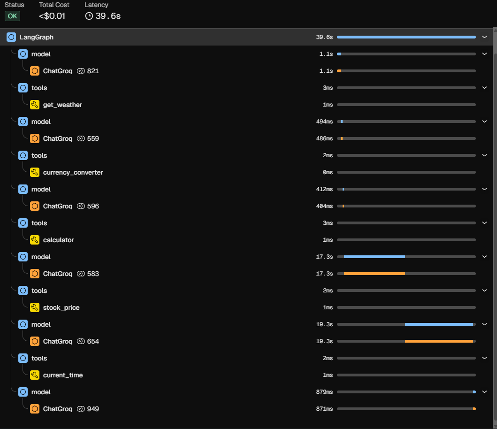
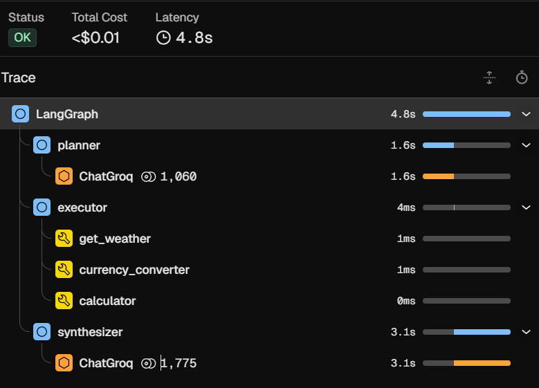

# Agent Performance Optimization: Sequential ReAct vs. DAG (LangGraph)

## Overview
This repository presents a case study on optimizing LLM agent performance by transitioning from a standard sequential ReAct architecture to a Directed Acyclic Graph (DAG) approach using LangGraph. 

By utilizing **OpenTelemetry** and the **Arize Phoenix UI** for trace observability, we analyzed the execution bottlenecks of a standard agent and implemented a parallelized DAG agent. The results demonstrate a drastic reduction in latency and token expense while maintaining high-quality responses from a heavy reasoning model.

---

## The Case Study: Tracing in Phoenix UI

While observing the traces in the Phoenix UI, a significant bottleneck was identified in the traditional agent setup (`agent.py`). 

The standard agent uses a ReAct (Reason + Act) loop. When given a complex query requiring multiple tools (e.g., fetching weather, calculating currency conversion, and performing math for splitting a bill), the agent calls the LLM, decides on a tool, executes it, and then **calls the LLM again** to reason about the next step. 

Because we are using a heavy reasoning model (`openai/gpt-oss-120b` with `reasoning_effort="high"`), each individual LLM call is computationally expensive and slow. 
* **Sequential Latency:** Waiting for the LLM to reason after *every single* tool call caused the overall execution time to average around **20 seconds**.
* **High Cost:** The overlapping context windows fed into multiple sequential LLM calls rapidly increased token usage.

To solve this, we implemented a DAG-based agent (`dag_agent.py`) that separates planning from execution. The planner identifies all necessary tools upfront, the executor runs them simultaneously, and a synthesizer drafts the final response.
* **Parallel Latency:** By utilizing parallel tool calling and reducing the workflow to exactly two LLM calls, the execution time plummeted to an average of **5 seconds**.

---

## Agent Architectures: Technical Details

### 1. Sequential ReAct Agent (`agent.py`)
This implementation relies on LangChain's out-of-the-box `create_agent` utility.

* **Framework:** `langchain.agents.create_agent`
* **Model:** `ChatGroq` (`openai/gpt-oss-120b`, `reasoning_effort="high"`)
* **Execution Flow:** 1. The user query is passed to the agent.
  2. The LLM reasons about the prompt and selects **Tool A**.
  3. Tool A executes and returns a result.
  4. The LLM is called *again*, taking Tool A's result into context, and reasons that it needs **Tool B**.
  5. This loop continues until the LLM determines it has enough information to generate a final answer.
* **Drawbacks:** Strict sequential execution. If a query requires 4 tools, it requires a minimum of 5 LLM calls. Latency stacks additively ($T_{llm1} + T_{tool1} + T_{llm2} + T_{tool2} ...$).

### 2. DAG Agent with Parallel Execution (`dag_agent.py`)
This implementation utilizes a custom State Graph to explicitly control the flow of reasoning and execution.

* **Framework:** `langgraph.graph.StateGraph`
* **Model:** `ChatGroq` (`openai/gpt-oss-120b`, `reasoning_effort="high"`)
* **State Schema (`AgentState`):** Maintains the `query`, `tasks` (planned tools), `tool_results`, and `final_response`.
* **Execution Flow (Nodes):**
  1. **Planner Node (`planner_node`):** An LLM call that takes the user query and extracts *all* independent, required tool calls upfront, returning them as a structured JSON list.
  2. **Executor Node (`executor_node`):** An asynchronous Python function that parses the JSON list and uses `asyncio.gather()` to execute all required tools in parallel. No LLM is used in this step.
  3. **Synthesizer Node (`synthesizer_node`):** A second LLM call that takes the original query alongside the combined JSON block of all tool results to draft the final, natural response.
* **Advantages:** High efficiency. No matter how many tools are required, the graph only ever makes **2 LLM calls** (Planner -> Synthesizer). Tool execution latency is not additive; it is only as slow as the single slowest tool in the concurrent batch.

---

## Observability & Tracing

Both agents are instrumented using OpenTelemetry and `openinference-instrumentation-langchain`. 

Traces are routed to a local instance of **Arize Phoenix** via `OTLPSpanExporter` at `http://127.0.0.1:6006/v1/traces`. By inspecting these traces, you can visually verify the dense, staircase-like spans of the sequential agent versus the flat, concurrent tool spans of the LangGraph DAG agent.

## ReAct AGENT


## DAG_AGENT 


## Getting Started

1. Clone the repository.
2. Install dependencies: 
   ```bash
   pip install -r requirements.txt